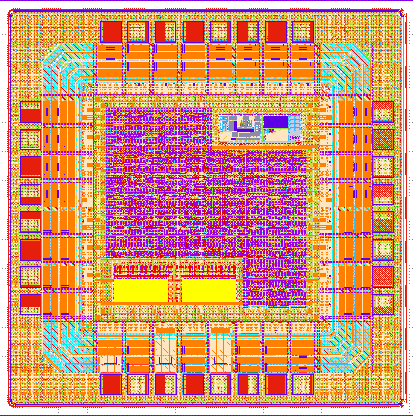

# RFID4410



| | |
|---|---|
| **Category** | Mixed-Signal / RFID |
| **Technology** | IHP SG13CMOS |
| **Top Cell** | `RFID4410` |
| **Die Size** | 1414um x 1414um |
| **License** | Apache-2.0 |

---

## Overview

RFID4410 implements a complete digital baseband for a HF RFID tag. It handles multi-level anti-collision, CRC-16 frame integrity, and 8 Kbit SRAM user memory — all within a chip-level design that includes padring and sealring.

### Features

- **Protocol engine** — 10-state FSM handling wake-up, anti-collision, selection, read, write, and halt
- **7-byte UID** — Two-level cascade anti-collision with bit-level arbitration
- **CRC-16/ISO-A** — Hardware CRC calc and check (poly `0x1021`, init `0x6363`)
- **8 Kbit SRAM** — 256 × 32-bit user memory via IHP `RM_IHPSG13_1P_256x32_c2_bm_bist` macro
- **Manchester TX** — Serial encoder with SOF/EOF framing and per-byte odd parity
- **Modified Miller RX** — Synchronous bit-level demodulator and frame assembler
- **DFT / BIST** — Test mode with FSM state forcing and direct SRAM BIST access
- **Chip-level integration** — Padring (32 pads), PMU macro, power delivery network

---

## Quick Start

### Prerequisites

- [IHP SG13G2 Open PDK](https://github.com/IHP-GmbH/IHP-Open-PDK)
- [LibreLane](https://github.com/efabless/librelane)
- [Icarus Verilog](http://iverilog.icarus.com/)
- [GTKWave](https://gtkwave.sourceforge.net/)

### Functional Simulation

```bash
cd RFID4410-main/testbenches
# quik sim
bash run_quick_sim.sh
gtkwave wave.vcd

# full sim
bash top_module_run_sim.sh
gtkwave wave.vcd
```

### Physical Implementation

```bash
cd RFID4410-main/Flow/scripts/LibreLane
librelane config.yaml --manual-pdk
```

## License

Licensed under the [Apache License 2.0](https://www.apache.org/licenses/LICENSE-2.0).

```
Copyright 2026 RFID4410 Authors

Licensed under the Apache License, Version 2.0 (the "License");
you may not use this file except in compliance with the License.
You may obtain a copy of the License at

    http://www.apache.org/licenses/LICENSE-2.0
```

